# Día 1: Configuración avanzada de la infraestructura de GCP

_Este repositorio documenta la creación y configuración de un entorno seguro y escalable en Google Cloud Platform (GCP), poniendo a prueba habilidades en scripting, manejo de APIs y diseño de arquitectura en la nube._

## 🎯 Objetivos
- Diseñar un proyecto en GCP con prácticas de seguridad y escalabilidad.  
- Implementar automatización mediante **Cloud Functions** y **Cloud Storage**.  
- Validar el flujo de trabajo con pruebas unitarias y documentación

---

## 🛠️ Tecnologías Utilizadas
- **Google Cloud Platform (GCP)**  
- **Cloud Storage, Cloud Functions, Pub/Sub, Logging, IAM**  
- **Python / Node.js**  
- **Unit Testing Frameworks**  

---

### Pre-requisitos 📋

_Creación de cuenta en Google Cloud_
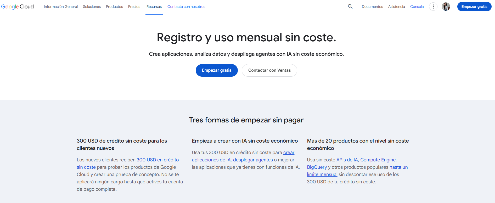
---
## 🛠️ 1. Creación y configuración del proyecto

### 🚀 Opción 1: Instalación de Google Cloud CLI

Sigue la [documentación oficial de Google Cloud](https://cloud.google.com/sdk/docs/install) para instalar la CLI en tu sistema operativo.

### Pasos básicos:
1. Descargar el instalador según tu plataforma (Windows, Linux, macOS).
2. Ejecutar el instalador o script de instalación. 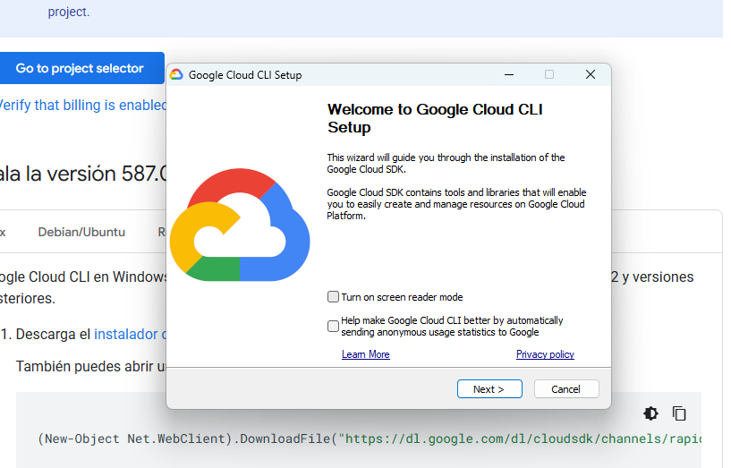

3. Inicializar la CLI con `gcloud init`. 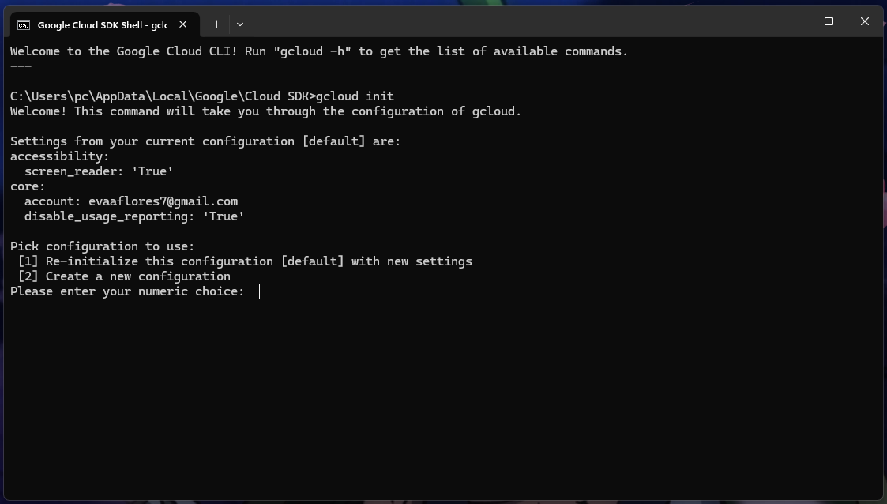
Esto abrirá un asistente interactivo para:
- Seleccionar tu cuenta de Google.
- Elegir el proyecto por defecto.

4. Configurar la región y zona predeterminadas. 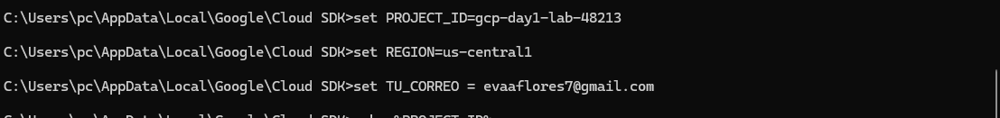
5. Verificar instalación con `gcloud --version`.
6. Autenticarse con `gcloud auth login` si es necesario.

## 🚀 Opción 2: Crear un nuevo proyecto en Google Cloud Platform

Además de instalar la consola de Cloud en la computadora, también se puede iniciar la simulación creando un nuevo proyecto directamente en la **Google Cloud Console**:

### 🛠️ Pasos
1. Ingresa a [Google Cloud Console](https://console.cloud.google.com). 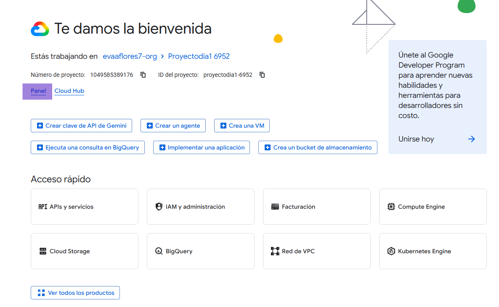
2. En la parte superior izquierda, haz clic en el **selector de proyectos**.
3. Pulsa **“Proyecto nuevo”**.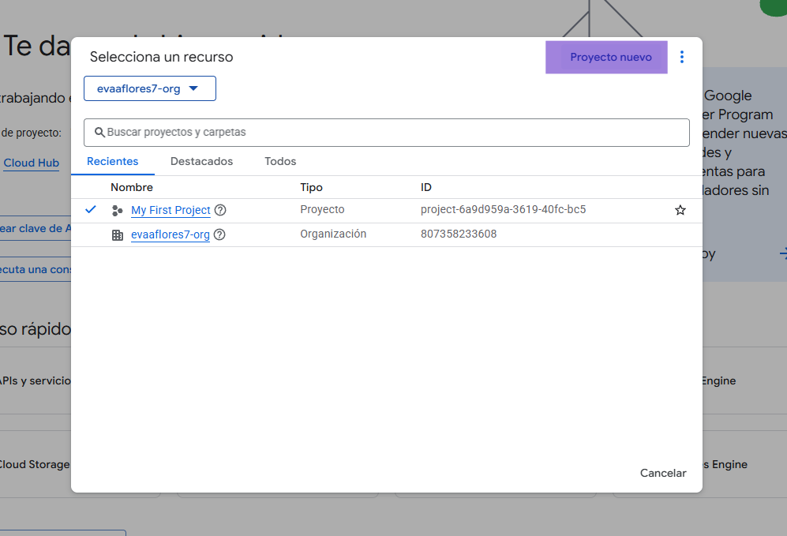
4. Asigna un nombre único (ejemplo: `proyectodia1 6952`). 
5. Selecciona la organización (si aplica) y define la ubicación.
6. Haz clic en **Crear**. 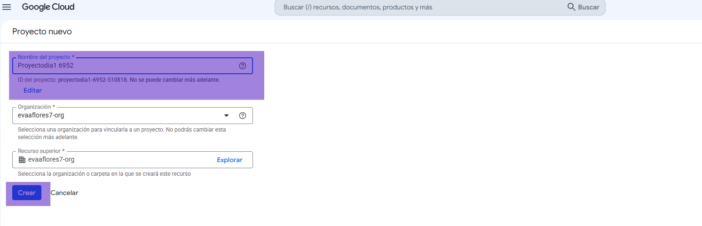
7. Se mostrara una notificación indicando que se completo la creación del proyecto.  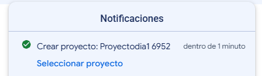
8. Una vez creado, podrás habilitar APIs, configurar IAM y gestionar recursos dentro de este proyecto.  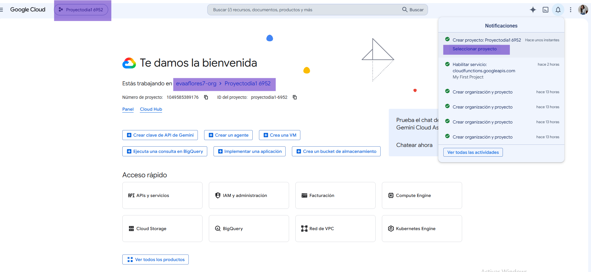

📖 Nota: Para crear recursos como buckets o máquinas virtuales será necesario tener la **facturación activada** en el proyecto.  


## ⚙️ Habilitación de APIs en GCP

Para que el proyecto funcione correctamente, es necesario habilitar las siguientes APIs en Google Cloud:

- **Cloud Storage**
- **Cloud Functions**
- **Cloud Pub/Sub**
- **Cloud Logging**
- *(Opcional)* **Cloud Build**

Ejecuta los siguientes comandos en tu terminal de Google Cloud SDK:

```bash
gcloud services enable storage.googleapis.com
gcloud services enable cloudfunctions.googleapis.com
gcloud services enable pubsub.googleapis.com
gcloud services enable logging.googleapis.com
# Opcional
gcloud services enable cloudbuild.googleapis.com

```
✅ Estos comandos habilitan las APIs necesarias para que tu entorno pueda crear buckets, desplegar funciones, manejar eventos y registrar logs.

## 📌 Habilitación de APIs desde la Google Cloud Console

O bien, empleando la **Google Cloud Console**:

1. En el menú lateral, selecciona **APIs y Servicios**. 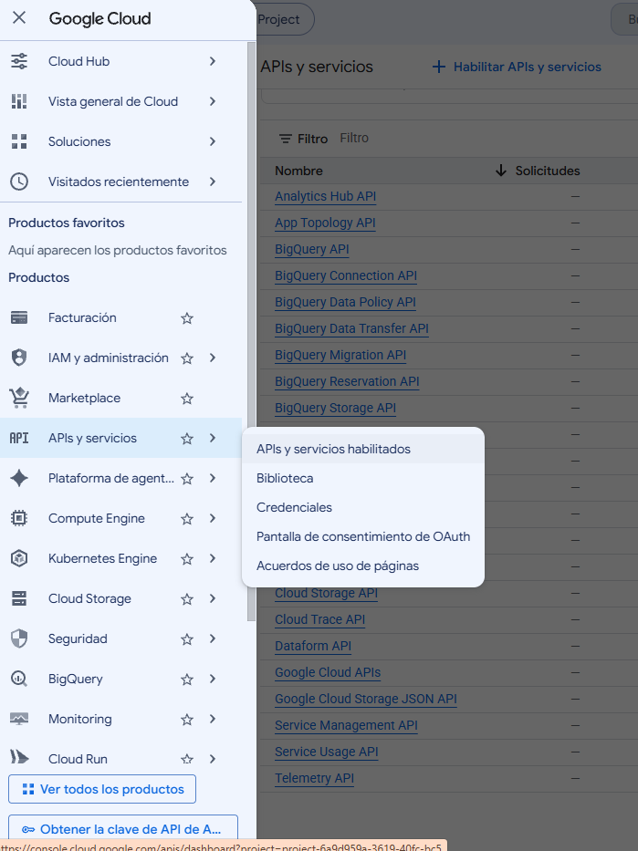
2. En la sección **APIs y Servicios habilitados**, identifica cuáles APIs ya están activas. 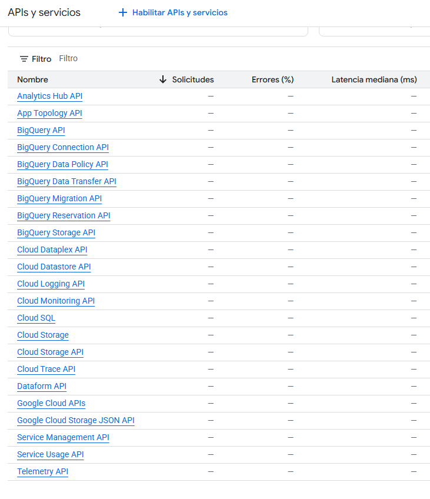
3. Si necesitas agregar una nueva, selecciona nuevamente **APIs y Servicios → Biblioteca** y habilita la API correspondiente. Cuando se habilita una nueva API desde la **Google Cloud Console**, el cambio se refleja inmediatamente en la sección **APIs y Servicios habilitados**. Las APIs activas aparecen destacadas en la lista con un estado diferente al de las que aún no están habilitadas, lo que permite identificar fácilmente cuáles ya están disponibles en el proyecto.
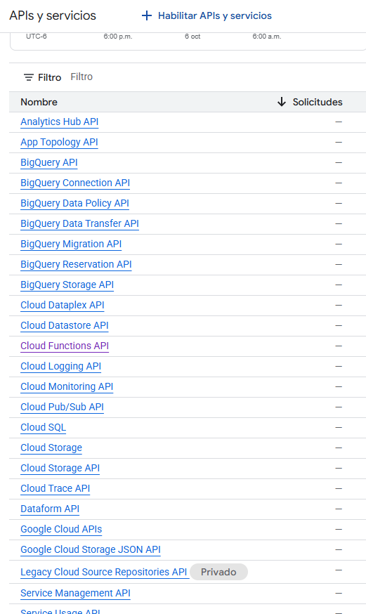

## 🔐 Configuración de Roles y Permisos (IAM)

Para simular un entorno de producción controlado, se recomienda crear un **usuario de prueba con privilegios mínimos** utilizando **Identity and Access Management (IAM)**.

### 📖 Referencia
Puedes revisar la documentación oficial de Google Cloud IAM para comprender cómo funciona la gestión de identidades y accesos:  
[Documentación IAM - Google Cloud](https://docs.cloud.google.com/iam/docs/overview?hl=es-419)

### 🛠️ Pasos en la Google Cloud Console
En la **Google Cloud Console**, la gestión de accesos se realiza desde la sección **IAM y Administración → IAM**.

1. Haz clic en **Otorgar acceso** para añadir un nuevo miembro (usuario o cuenta de servicio). 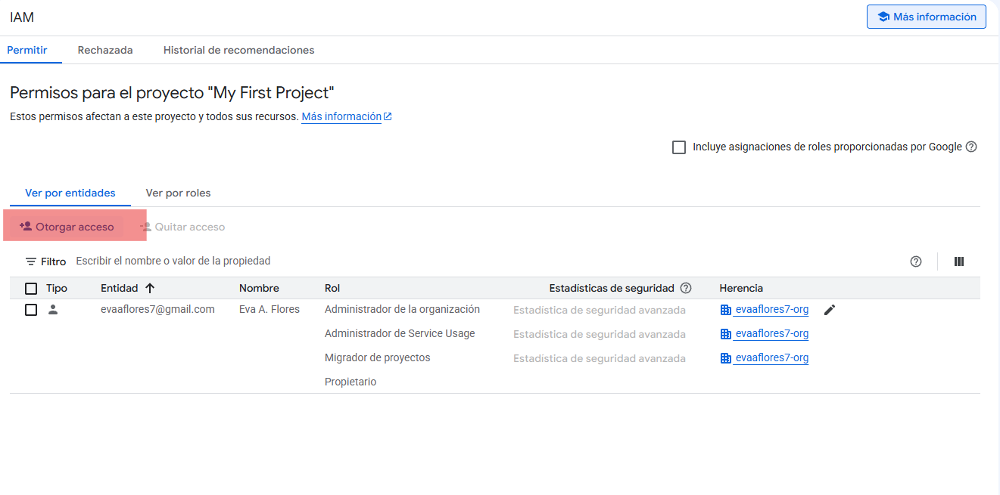
2. Ingresa el correo electrónico del usuario de prueba.  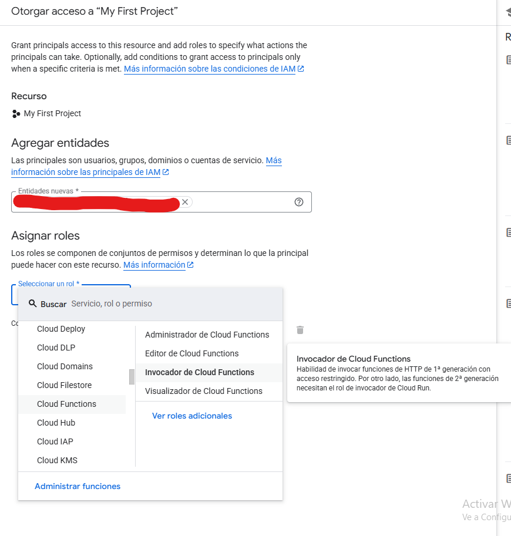 
3. Selecciona un rol con privilegios mínimos, por ejemplo:
   - **Viewer** → acceso de solo lectura a todo el proyecto.
   - **Storage Object Viewer** → acceso de solo lectura a objetos en Cloud Storage.
4. Guarda los cambios. El nuevo usuario aparecerá en la lista con los permisos asignados. 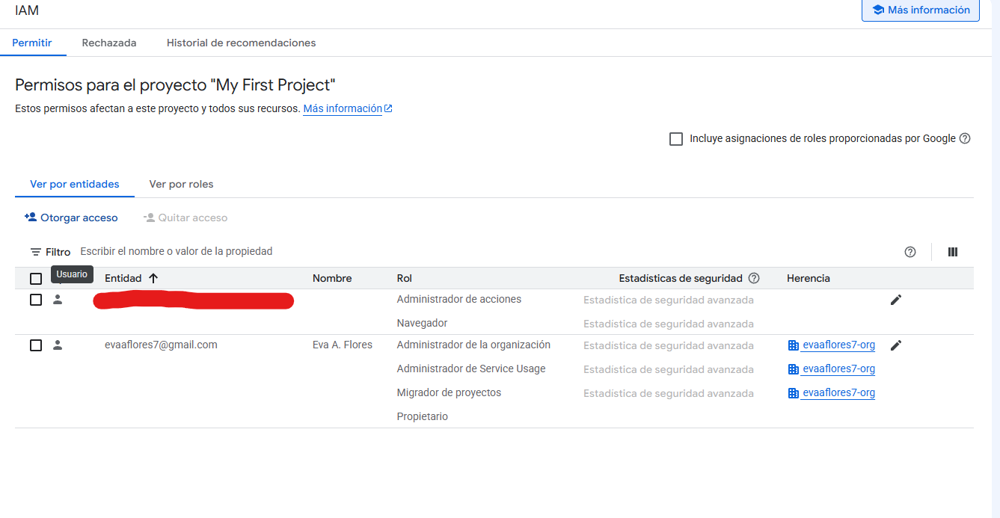
5. En caso de ser necesario, se pueden editar los permisos 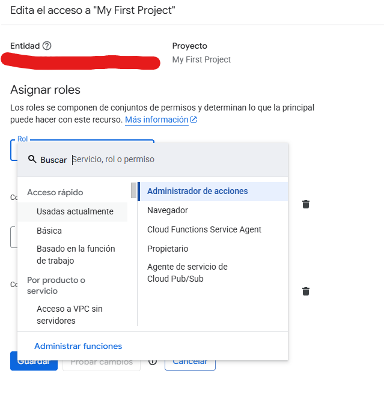

✅ Con estos pasos, el usuario de prueba tendrá acceso restringido, lo que permite simular un entorno seguro y controlado.

## 🔐 Buenas prácticas de asignación de privilegios

Para garantizar un entorno controlado y seguro en producción, se recomienda aplicar el principio de **privilegios mínimos** al asignar roles y permisos en IAM.  
Esto significa otorgar únicamente los permisos estrictamente necesarios para cada usuario o cuenta de servicio.

📖 Para más detalles sobre buenas prácticas de seguridad en IAM, consulta la documentación oficial:  
[Usar IAM de forma segura - Google Cloud](https://docs.cloud.google.com/iam/docs/using-iam-securely?hl=es-419)

---
# 2. Diseño de Almacenamiento y Automatización ⚙️
---

##  Crear el bucket en Cloud Storage

1. Ingresa a [console.cloud.google.com](https://console.cloud.google.com) y selecciona el proyecto. 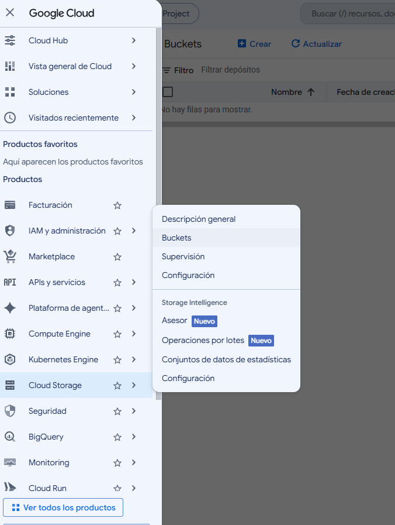
2. Ve a **Cloud Storage → Buckets → Crear**.  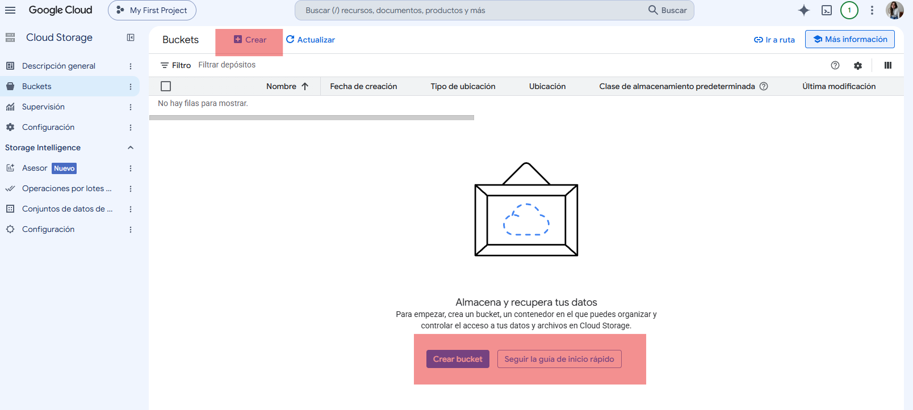
3. Configura los siguientes parámetros:

| Paso | Configuración recomendada |
|---|---|
| **Nombre** | Único globalmente, por ejemplo `example-bucket-prueba-01` |
| **Ubicación** | Región, birregión o multirregión según latencia, costo y residencia de datos |
| **Clase de almacenamiento** | `Standard` (las reglas de ciclo de vida la cambiarán después) |
| **Control de acceso** | Activar **Prevenir acceso público** y elegir **Uniforme** |
| **Protección de datos** | Activar **control de versiones**, definir **política de retención** y revisar *soft delete* |

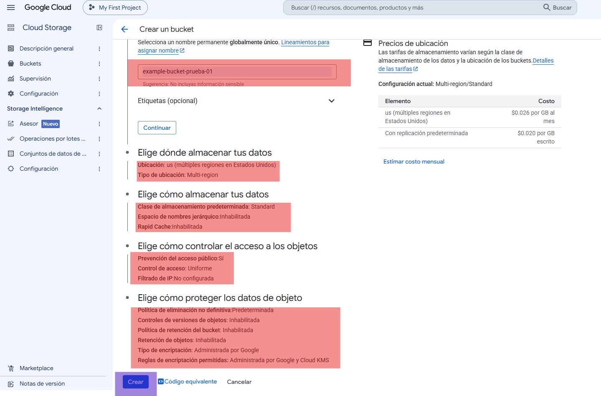

4. Haz clic en **Crear**.

> **Nota:** con el control de acceso uniforme, todo el acceso se gestiona únicamente con IAM, sin ACL por objeto.

### 📂 Información adicional sobre configuración

Para mayor información acerca de las opciones de configuración y selección utilizadas, se creó un archivo complementario:

- [Creación del bucket: opciones y justificación](files/creacion-bucket.md)

📖 Además, se consultó la documentación oficial de Google Cloud Storage para la creación de buckets:  
[Crear buckets - Google Cloud](https://docs.cloud.google.com/storage/docs/creating-buckets?hl=es-419)

---

